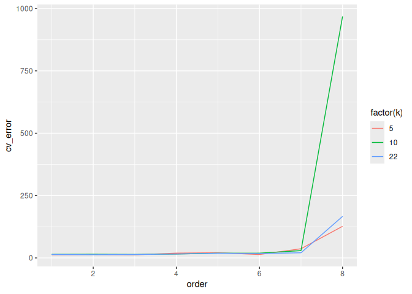
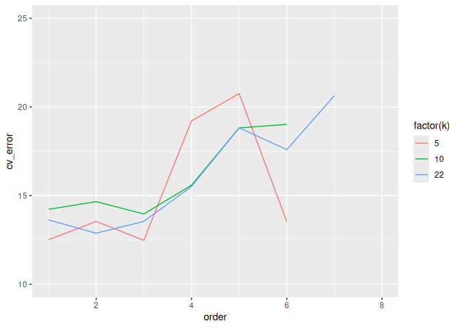

Ant data: k-fold cross validation
================
Brett Melbourne
13 Jan 2026

Explore the cross-validation **inference algorithm** from scratch with
the ants data and a polynomial model. Our goal is to predict richness of
forest ants from latitude. What order of a polynomial **model
algorithm** gives the most accurate predictions?

``` r
library(ggplot2)
library(dplyr)
library(tidyr) #for pivot_longer()
```

Ant data:

``` r
ants <- read.csv("data/ants.csv")
head(ants)
```

    ##   site habitat latitude elevation richness
    ## 1  TPB  forest    41.97       389        6
    ## 2  HBC  forest    42.00         8       16
    ## 3  CKB  forest    42.03       152       18
    ## 4  SKP  forest    42.05         1       17
    ## 5   CB  forest    42.05       210        9
    ## 6   RP  forest    42.17        78       15

Forest ant data:

``` r
forest_ants <- ants |> 
    filter(habitat=="forest")

forest_ants |>
    ggplot() +
    geom_point(aes(x=latitude, y=richness)) +
    ylim(0,20)
```

<!-- -->

### Model algorithm

Here’s one way we could code a 3rd order polynomial by first creating
new variables for the quadratic (squared) and cubic (cubed) terms, and
using R’s model formula syntax to train the model by minimizing the SSQ
with the function `lm`.

``` r
forest_ants$latitude_2 <- forest_ants$latitude ^ 2
forest_ants$latitude_3 <- forest_ants$latitude ^ 3
head(forest_ants)
```

    ##   site habitat latitude elevation richness latitude_2 latitude_3
    ## 1  TPB  forest    41.97       389        6   1761.481   73929.35
    ## 2  HBC  forest    42.00         8       16   1764.000   74088.00
    ## 3  CKB  forest    42.03       152       18   1766.521   74246.87
    ## 4  SKP  forest    42.05         1       17   1768.202   74352.92
    ## 5   CB  forest    42.05       210        9   1768.202   74352.92
    ## 6   RP  forest    42.17        78       15   1778.309   74991.29

``` r
lm(richness ~ latitude + latitude_2 + latitude_3, data=forest_ants)
```

    ## 
    ## Call:
    ## lm(formula = richness ~ latitude + latitude_2 + latitude_3, data = forest_ants)
    ## 
    ## Coefficients:
    ## (Intercept)     latitude   latitude_2   latitude_3  
    ##  84336.3595   -5736.2100     130.0406      -0.9825

A model formula provides a shorthand notation for (mostly) linear
models, e.g. `y ~ x + z` is shorthand for the model:

$$
y = \beta_0 + \beta_1 x + \beta_2 z
$$

Here’s another way to code the same model that eliminates the need to
create new variables for higher order terms.

``` r
lm(richness ~ latitude + I(latitude^2) + I(latitude^3), data=forest_ants)
```

    ## 
    ## Call:
    ## lm(formula = richness ~ latitude + I(latitude^2) + I(latitude^3), 
    ##     data = forest_ants)
    ## 
    ## Coefficients:
    ##   (Intercept)       latitude  I(latitude^2)  I(latitude^3)  
    ##    84336.3595     -5736.2100       130.0406        -0.9825

The `I()` function ensures that `^` is not interpreted as model formula
syntax. See `?formula` for more details about model formulae. An even
more convenient way uses the function `poly()`, which creates a matrix
of the polynomial terms.

``` r
poly(forest_ants$latitude, degree=3, raw=TRUE)
```

    ##           1        2        3
    ##  [1,] 41.97 1761.481 73929.35
    ##  [2,] 42.00 1764.000 74088.00
    ##  [3,] 42.03 1766.521 74246.87
    ##  [4,] 42.05 1768.202 74352.92
    ##  [5,] 42.05 1768.202 74352.92
    ##  [6,] 42.17 1778.309 74991.29
    ##  [7,] 42.19 1779.996 75098.04
    ##  [8,] 42.23 1783.373 75311.84
    ##  [9,] 42.27 1786.753 75526.05
    ## [10,] 42.31 1790.136 75740.66
    ## [11,] 42.56 1811.354 77091.21
    ## [12,] 42.57 1812.205 77145.56
    ## [13,] 42.58 1813.056 77199.94
    ## [14,] 42.69 1822.436 77799.80
    ## [15,] 43.33 1877.489 81351.59
    ## [16,] 44.06 1941.284 85532.96
    ## [17,] 44.29 1961.604 86879.45
    ## [18,] 44.33 1965.149 87115.05
    ## [19,] 44.50 1980.250 88121.12
    ## [20,] 44.55 1984.702 88418.50
    ## [21,] 44.76 2003.458 89674.76
    ## [22,] 44.95 2020.503 90821.59
    ## attr(,"degree")
    ## [1] 1 2 3
    ## attr(,"class")
    ## [1] "poly"   "matrix"

We can use this directly within a model formula

``` r
lm(richness ~ poly(latitude, degree=3, raw=TRUE), data=forest_ants)
```

    ## 
    ## Call:
    ## lm(formula = richness ~ poly(latitude, degree = 3, raw = TRUE), 
    ##     data = forest_ants)
    ## 
    ## Coefficients:
    ##                             (Intercept)  
    ##                              84336.3595  
    ## poly(latitude, degree = 3, raw = TRUE)1  
    ##                              -5736.2100  
    ## poly(latitude, degree = 3, raw = TRUE)2  
    ##                                130.0406  
    ## poly(latitude, degree = 3, raw = TRUE)3  
    ##                                 -0.9825

A potential problem with polynomial models is that the higher order
terms can become almost perfectly correlated with one another, leading
to models where the parameters can’t all be uniquely estimated. For
example, for these data the fourth order polynomial can be trained but
for the fifth order polynomial we can’t determine a unique value for the
highest order parameter, and the parameter estimates remain the same as
the fourth order model. We have essentially run out of uniqueness among
the polynomial terms due to the high correlations.

``` r
lm(richness ~ poly(latitude, degree=4, raw=TRUE), data=forest_ants)
```

    ## 
    ## Call:
    ## lm(formula = richness ~ poly(latitude, degree = 4, raw = TRUE), 
    ##     data = forest_ants)
    ## 
    ## Coefficients:
    ##                             (Intercept)  
    ##                              -1.615e+06  
    ## poly(latitude, degree = 4, raw = TRUE)1  
    ##                               1.509e+05  
    ## poly(latitude, degree = 4, raw = TRUE)2  
    ##                              -5.281e+03  
    ## poly(latitude, degree = 4, raw = TRUE)3  
    ##                               8.209e+01  
    ## poly(latitude, degree = 4, raw = TRUE)4  
    ##                              -4.781e-01

``` r
lm(richness ~ poly(latitude, degree=5, raw=TRUE), data=forest_ants)
```

    ## 
    ## Call:
    ## lm(formula = richness ~ poly(latitude, degree = 5, raw = TRUE), 
    ##     data = forest_ants)
    ## 
    ## Coefficients:
    ##                             (Intercept)  
    ##                              -1.615e+06  
    ## poly(latitude, degree = 5, raw = TRUE)1  
    ##                               1.509e+05  
    ## poly(latitude, degree = 5, raw = TRUE)2  
    ##                              -5.281e+03  
    ## poly(latitude, degree = 5, raw = TRUE)3  
    ##                               8.209e+01  
    ## poly(latitude, degree = 5, raw = TRUE)4  
    ##                              -4.781e-01  
    ## poly(latitude, degree = 5, raw = TRUE)5  
    ##                                      NA

``` r
cor(poly(forest_ants$latitude, degree=5, raw=TRUE))
```

    ##           1         2         3         4         5
    ## 1 1.0000000 0.9999785 0.9999141 0.9998067 0.9996564
    ## 2 0.9999785 1.0000000 0.9999785 0.9999141 0.9998067
    ## 3 0.9999141 0.9999785 1.0000000 0.9999785 0.9999141
    ## 4 0.9998067 0.9999141 0.9999785 1.0000000 0.9999785
    ## 5 0.9996564 0.9998067 0.9999141 0.9999785 1.0000000

This problem can be markedly reduced by using orthogonal polynomials,
which remove the correlation among the polynomial terms. Orthogonal
polynomials are the default type for `poly()`, i.e. without `raw=TRUE`.

``` r
lm(richness ~ poly(latitude, degree=5), data=forest_ants)
```

    ## 
    ## Call:
    ## lm(formula = richness ~ poly(latitude, degree = 5), data = forest_ants)
    ## 
    ## Coefficients:
    ##                 (Intercept)  poly(latitude, degree = 5)1  
    ##                      9.1818                     -11.6039  
    ## poly(latitude, degree = 5)2  poly(latitude, degree = 5)3  
    ##                      6.1704                      -2.6291  
    ## poly(latitude, degree = 5)4  poly(latitude, degree = 5)5  
    ##                     -0.8511                       2.7290

``` r
cor(poly(forest_ants$latitude, degree=5))
```

    ##               1             2            3             4             5
    ## 1  1.000000e+00 -4.567202e-18 9.958397e-17 -1.168363e-16  2.687466e-17
    ## 2 -4.567202e-18  1.000000e+00 1.086913e-17  1.630369e-17 -5.149960e-19
    ## 3  9.958397e-17  1.086913e-17 1.000000e+00  4.305638e-17  6.166400e-18
    ## 4 -1.168363e-16  1.630369e-17 4.305638e-17  1.000000e+00 -1.918360e-17
    ## 5  2.687466e-17 -5.149960e-19 6.166400e-18 -1.918360e-17  1.000000e+00

Orthogonal polynomials give the same predictions as the raw polynomials.
It’s just a difference in parameterization of the same model. In machine
learning we don’t care about the parameter values, just the resulting
prediction, so it’s best to choose the more robust parameterization.

### Training algorithm

R’s `lm()` function contains a **training algorithm** that finds the
parameters that minimize the sum of squared deviations of the data from
the model. The following code trains the order 4 polynomial and plots
the fitted model. Use this block of code to try different values for the
order of the polynomial. For this small dataset, we can get up to order
16, after which we can no longer form orthogonal polynomials.

``` r
order <- 4 #integer
poly_trained <- lm(richness ~ poly(latitude, order), data=forest_ants)
grid_latitude  <- seq(min(forest_ants$latitude), max(forest_ants$latitude), length.out=201)
nd <- data.frame(latitude=grid_latitude)
pred_richness <- predict(poly_trained, newdata=nd)
preds <- cbind(nd, richness=pred_richness)

ggplot(data=NULL, aes(x=latitude, y=richness)) +
    geom_point(data=forest_ants) +
    geom_line(data=preds) +
    coord_cartesian(ylim=c(0,20)) +
    labs(title=paste("Polynomial order", order))
```

<!-- -->

Use `predict` to ask for predictions from the trained polynomial model.
For example, here we are asking for the prediction at latitude 43.2 and
we find the predicted richness is 5.45. We need to provide the predictor
variable `latitude` as a data frame even if it’s just one value. See
`?predict.lm`.

``` r
predict(poly_trained, newdata=data.frame(latitude=43.2))
```

    ##        1 
    ## 5.450208

### Inference algorithm

Exploring the k-fold CV algorithm

First, we need a function to divide the dataset up into partitions.

``` r
# Function to divide a dataset into random partitions for cross-validation
# n:       length of dataset (scalar, integer)
# k:       number of partitions (scalar, integer)
# return:  partition labels (vector, integer)
# 
random_partitions <- function(n, k) {
    min_n <- floor(n / k)
    extras <- n - k * min_n
    labels <- c(rep(1:k, each=min_n),rep(seq_len(extras)))
    partitions <- sample(labels, n)
    return(partitions)
}
```

What does the output of `random_partitions()` produce? It’s a set of
labels that says which partition each data point belongs to.

``` r
random_partitions(nrow(forest_ants), k=5)
```

    ##  [1] 1 1 5 1 4 1 5 4 5 3 3 1 5 4 4 3 2 2 2 3 2 2

``` r
random_partitions(nrow(forest_ants), k=nrow(forest_ants))
```

    ##  [1] 17 22 16  6 14 21  8 10 11  4  2  1  7 15  3 13 12 19 18 20  9  5

Now code up the k-fold CV algorithm (from our pseudocode to R code) to
estimate the prediction mean squared error for one order of the
polynomial. Try 5-fold, 10-fold, and n-fold CV. Try different values for
polynomial order.

``` r
k <- 10
order <- 3

# divide dataset into k parts i = 1...k
forest_ants$partition <- random_partitions(nrow(forest_ants), k)

e <- rep(NA, k) # we'll need this to store the error from each test

# for each i
for ( i in 1:k ) {
#     test dataset = part i
    test_data <- subset(forest_ants, partition == i)
#     training dataset = remaining data
    train_data <- subset(forest_ants, partition != i)
#     find f using training dataset
    f_trained <- lm(richness ~ poly(latitude, order), data=train_data)
#     use f to predict for test dataset
    pred_richness <- predict(f_trained, newdata=test_data)
#     e_i = prediction error (MSE)
    e[i] <- mean((test_data$richness - pred_richness) ^ 2)
}
# CV_error = mean(e)
cv_error <- mean(e)
cv_error
```

    ## [1] 13.6618

To help us do systematic experiments to explore different combinations
of `order` and `k` we’ll encapsulate the above code as a function.

``` r
# Function to perform k-fold CV for a polynomial model on ants data
# forest_ants: dataframe
# k:           number of partitions (scalar, integer)
# order:       degrees of polynomial (scalar, integer)
# return:      CV error as MSE (scalar, numeric)

cv_poly_ants <- function(forest_ants, k, order) {
    forest_ants$partition <- random_partitions(nrow(forest_ants), k)
    e <- rep(NA, k)
    for ( i in 1:k ) {
        test_data <- subset(forest_ants, partition == i)
        train_data <- subset(forest_ants, partition != i)
        f_trained <- lm(richness ~ poly(latitude, order), data=train_data)
        pred_richness <- predict(f_trained, newdata=test_data)
        e[i] <- mean((test_data$richness - pred_richness) ^ 2)
    }
    cv_error <- mean(e)
    return(cv_error)
}
```

Test the function

``` r
cv_poly_ants(forest_ants, k=10, order=4)
```

    ## [1] 21.25066

``` r
cv_poly_ants(forest_ants, k=22, order=4)
```

    ## [1] 15.51312

Explore a grid of values for k and polynomial order.

We could use nested iteration structures like this to calculate the CV
error for different combinations of k and order.

``` r
output <- matrix(nrow=24, ncol=3)
colnames(output) <- c("k", "order", "cv_error")
i <- 1
for ( k in c(5, 10, 22 ) ) {
    for (order in 1:8 ) {
        output[i,1:2] <- c(k, order)
        output[i,3] <- cv_poly_ants(forest_ants, k, order)
        i <- i + 1
    }
}
output
```

    ##        k order   cv_error
    ##  [1,]  5     1   13.97185
    ##  [2,]  5     2   13.69318
    ##  [3,]  5     3   13.96978
    ##  [4,]  5     4   14.96778
    ##  [5,]  5     5   21.34449
    ##  [6,]  5     6   20.01552
    ##  [7,]  5     7   27.41351
    ##  [8,]  5     8  371.34691
    ##  [9,] 10     1   13.05066
    ## [10,] 10     2   13.97829
    ## [11,] 10     3   12.93328
    ## [12,] 10     4   13.75647
    ## [13,] 10     5   16.39832
    ## [14,] 10     6   16.80868
    ## [15,] 10     7   23.95342
    ## [16,] 10     8 1098.87529
    ## [17,] 22     1   13.63068
    ## [18,] 22     2   12.87801
    ## [19,] 22     3   13.54701
    ## [20,] 22     4   15.51312
    ## [21,] 22     5   18.82428
    ## [22,] 22     6   17.59199
    ## [23,] 22     7   20.63740
    ## [24,] 22     8  166.56106

But a neater and easier solution uses the `expand.grid()` function.
We’ll also set a random seed so that the result is repeatable.

``` r
set.seed(1193) #For reproducible results

grid <- expand.grid(k=c(5,10,nrow(forest_ants)), order=1:8 )
cv_error <- rep(NA, nrow(grid))
for( i in 1:nrow(grid) ) {
    cv_error[i] <- cv_poly_ants(forest_ants, k=grid$k[i], order=grid$order[i])
}
result1 <- cbind(grid, cv_error)
result1
```

    ##     k order  cv_error
    ## 1   5     1  12.51091
    ## 2  10     1  14.22752
    ## 3  22     1  13.63068
    ## 4   5     2  13.54444
    ## 5  10     2  14.65926
    ## 6  22     2  12.87801
    ## 7   5     3  12.47381
    ## 8  10     3  13.96589
    ## 9  22     3  13.54701
    ## 10  5     4  19.21096
    ## 11 10     4  15.58679
    ## 12 22     4  15.51312
    ## 13  5     5  20.75803
    ## 14 10     5  18.81767
    ## 15 22     5  18.82428
    ## 16  5     6  13.53496
    ## 17 10     6  19.01667
    ## 18 22     6  17.59199
    ## 19  5     7  36.78863
    ## 20 10     7  29.31082
    ## 21 22     7  20.63740
    ## 22  5     8 126.88288
    ## 23 10     8 968.40216
    ## 24 22     8 166.56106

Plot

``` r
result1 |>
    ggplot() +
    geom_line(aes(x=order, y=cv_error, col=factor(k)))
```

<!-- -->

We see that prediction error is very large for order \> 7. We need to
adjust the y-axis limits to zoom in.

``` r
result1 |>
    ggplot() +
    geom_line(aes(x=order, y=cv_error, col=factor(k))) +
    ylim(10,25)
```

    ## Warning: Removed 5 rows containing missing values or values outside the scale range
    ## (`geom_line()`).

<!-- -->

but now the y limits break the line segments that fall outside the
limits. We need to use `coord_cartesian()` to set the limits instead.

``` r
result1 |>
    ggplot() +
    geom_line(aes(x=order, y=cv_error, col=factor(k))) +
    coord_cartesian(ylim=c(10,25))
```

<!-- -->

We see that MSE prediction error (cv_error) generally increases for
order greater than 2 or 3. We also see that cv_error estimates are
variable for k=10 and especially k=5. This is due to the randomness of
partitioning a very small dataset. If we repeat the above with a
different seed, we’d get different results for k=5 or k=10. LOOCV is
deterministic for this model, so it won’t differ if we repeat it.

LOOCV (k=22) identifies order=2 as the best performing model, whereas in
this particular run 10-fold and 5-fold CV identify order=3.

This variability illustrates that we should be mindful that k-fold CV
can be noisy. What should we do here? Given the uncertainty in MSE
estimates for k = 5 or 10, we’d be best to use LOOCV as a default
(generally a good strategy for small datasets). We could also try for a
better estimate by repeated k-fold runs. Let’s explore the variability
in 5-fold and 10-fold CV.

``` r
set.seed(1978) #For reproducible results
grid <- expand.grid(k=c(5,10), order=1:7)
reps <- 100
cv_error <- matrix(NA, nrow=nrow(grid), ncol=reps)
for ( j in 1:reps ) {
    for ( i in 1:nrow(grid) ) {
        cv_error[i,j] <- cv_poly_ants(forest_ants, grid$k[i], grid$order[i])
    }
    print(j) #monitor progress
}
result2 <- cbind(grid, cv_error)
```

Plot the first 10 reps for each k-fold

``` r
result2 |> 
    select(1:12) |>
    mutate(k=paste(k, "-fold CV", sep="")) |>
    pivot_longer(cols="1":"10", names_to="rep", values_to="cv_error") |> 
    mutate(rep=as.numeric(rep)) |> 
    ggplot() +
    geom_line(aes(x=order, y=cv_error, col=factor(rep))) +
    facet_wrap(vars(k)) +
    coord_cartesian(ylim=c(10,25))
```

<!-- -->

We see again that there is more variability for 5-fold CV. For both
5-fold and 10-fold CV there is so much variability, we’d pick different
values for order on different runs. So, we might not want to rely on a
single k-fold run.

Averaging across runs would give a better estimate of the prediction
MSE:

``` r
result2$mean_cv <- rowMeans(result2[,-(1:2)])
```

From the plot of the average for k = 5 and 10, we’d pick the same order
as LOOCV (k=22).

``` r
loocv <- result1 |> 
    filter(k == 22, order <= 7)

result2 |>
    select(k, order, mean_cv) |>
    rename(cv_error=mean_cv) |>
    bind_rows(loocv) |>
    ggplot() +
    geom_line(aes(x=order, y=cv_error, col=factor(k))) +
    labs(title=paste("Mean across",reps,"k-fold CV runs"), col="k") +
    coord_cartesian(ylim=c(10,25))
```

<!-- -->

Finally, here is the table of results

``` r
result2 |>
    select(k, order, mean_cv) |>
    rename(cv_error=mean_cv) |>
    bind_rows(loocv) |>
    arrange(k)
```

    ##     k order  cv_error
    ## 1   5     1  13.86612
    ## 2   5     2  13.28737
    ## 3   5     3  13.95757
    ## 4   5     4  16.61083
    ## 5   5     5  34.68352
    ## 6   5     6  44.19597
    ## 7   5     7 541.31817
    ## 8  10     1  13.88586
    ## 9  10     2  13.08073
    ## 10 10     3  13.59626
    ## 11 10     4  15.80397
    ## 12 10     5  23.08107
    ## 13 10     6  20.50202
    ## 14 10     7  77.69030
    ## 15 22     1  13.63068
    ## 16 22     2  12.87801
    ## 17 22     3  13.54701
    ## 18 22     4  15.51312
    ## 19 22     5  18.82428
    ## 20 22     6  17.59199
    ## 21 22     7  20.63740
