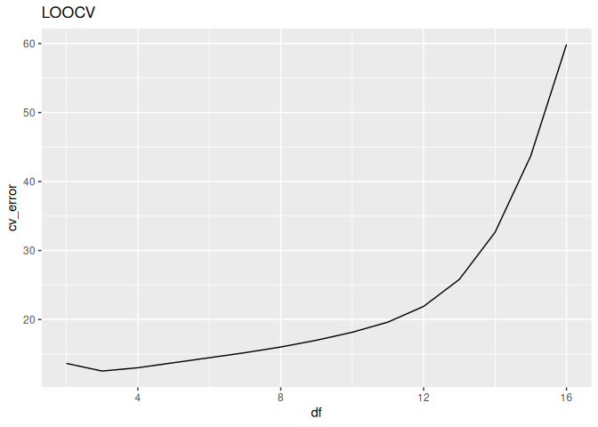
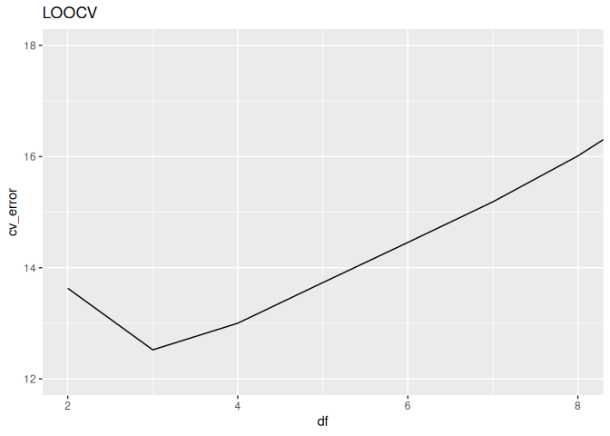

Ant data: smoothing spline model
================
Brett Melbourne
29 Jan 2024 (updated 20 Jan 2026)

Investigate cross-validation with the ants data and a smoothing-spline
model

``` r
library(ggplot2)
library(dplyr)
source("source/random_partitions.R") #Function is now in our custom library
```

Forest ant data:

``` r
forest_ants <- read.csv("data/ants.csv") |> 
    filter(habitat=="forest")
```

## Model + training algorithms

Example of a smoothing spline model. The training algorithm is penalized
least squares. Try running this next block of code to visualize the
model predictions for different values of `df`. Here is df=7.

``` r
smooth_trained <- smooth.spline(forest_ants$latitude, forest_ants$richness, df=7)
grid_latitude  <- seq(min(forest_ants$latitude), max(forest_ants$latitude), length.out=201)
preds <- data.frame(predict(smooth_trained, x=grid_latitude))
forest_ants |> 
    ggplot() +
    geom_point(aes(x=latitude, y=richness)) +
    geom_line(data=preds, aes(x=x, y=y)) +
    coord_cartesian(ylim=c(0,20))
```

<!-- -->

Using `predict` to ask for predictions from the trained smoothing spline
model.

``` r
predict(smooth_trained, x=43.2)
```

    ## $x
    ## [1] 43.2
    ## 
    ## $y
    ## [1] 6.153927

``` r
predict(smooth_trained, x=forest_ants$latitude)
```

    ## $x
    ##  [1] 41.97 42.00 42.03 42.05 42.05 42.17 42.19 42.23 42.27 42.31 42.56 42.57
    ## [13] 42.58 42.69 43.33 44.06 44.29 44.33 44.50 44.55 44.76 44.95
    ## 
    ## $y
    ##  [1] 12.817055 12.912472 12.958514 12.947059 12.947059 12.286418 12.109456
    ##  [8] 11.736305 11.328454 10.880076  7.816294  7.688693  7.561640  6.342989
    ## [15]  6.643114  6.319358  5.750168  5.793960  6.298994  6.426903  6.377938
    ## [22]  6.057080

``` r
predict(smooth_trained, x=seq(41, 45, by=0.5))
```

    ## $x
    ## [1] 41.0 41.5 42.0 42.5 43.0 43.5 44.0 44.5 45.0
    ## 
    ## $y
    ## [1]  9.444714 11.183034 12.912472  8.577191  5.497952  7.031636  6.517861
    ## [8]  6.298994  5.967671

## Inference algorithm

Since it’s a small dataset, leave one out cross validation (LOOCV) is a
good choice. LOOCV is deterministic for this model.

The CV function is essentially the same as for the polynomial model
(largely copy and paste), except we have switched out the polynomial
model for the smoothing spline.

``` r
# Function to perform k-fold CV for a smoothing spline on ants data
# forest_ants: forest ants dataset (dataframe)
# k:           number of partitions (scalar, integer)
# df:          degrees of freedom in smoothing spline (scalar, integer)
# return:      CV error as MSE (scalar, numeric)
#
cv_smooth_ants <- function(forest_ants, k, df) {
    forest_ants$partition <- random_partitions(nrow(forest_ants), k)
    e <- rep(NA, k)
    for ( i in 1:k ) {
        test_data <- subset(forest_ants, partition == i)
        train_data <- subset(forest_ants, partition != i)
        smooth_trained <- smooth.spline(train_data$latitude, train_data$richness, df=df)
        pred_richness <- predict(smooth_trained, test_data$latitude)$y
        e[i] <- mean((test_data$richness - pred_richness) ^ 2)
    }
    cv_error <- mean(e)
    return(cv_error)
}
```

Test/use the function (in LOOCV mode)

``` r
nrow(forest_ants) #22 data points
```

    ## [1] 22

``` r
cv_smooth_ants(forest_ants, k=22, df=7)
```

    ## [1] 15.18528

Explore a grid of values for df (k is always 22 for LOOCV)

``` r
grid <- expand.grid(k=nrow(forest_ants), df=2:16)
grid
```

    ##     k df
    ## 1  22  2
    ## 2  22  3
    ## 3  22  4
    ## 4  22  5
    ## 5  22  6
    ## 6  22  7
    ## 7  22  8
    ## 8  22  9
    ## 9  22 10
    ## 10 22 11
    ## 11 22 12
    ## 12 22 13
    ## 13 22 14
    ## 14 22 15
    ## 15 22 16

``` r
cv_error <- rep(NA, nrow(grid))
for ( i in 1:nrow(grid) ) {
    cv_error[i] <- cv_smooth_ants(forest_ants, grid$k[i], grid$df[i])
}
result <- cbind(grid, cv_error)
```

Plot the result.

``` r
result |>
    ggplot() +
    geom_line(aes(x=df, y=cv_error)) +
    labs(title="LOOCV")
```

<!-- -->

We see that MSE prediction error (cv_error) increases dramatically for
df beyond 8 or so.

``` r
result |> 
    ggplot() +
    geom_line(aes(x=df, y=cv_error)) +
    coord_cartesian(xlim=c(2,8), ylim=c(12,18)) +
    labs(title="LOOCV")
```

<!-- -->

Table of results

``` r
result
```

    ##     k df cv_error
    ## 1  22  2 13.63027
    ## 2  22  3 12.52225
    ## 3  22  4 13.00204
    ## 4  22  5 13.73207
    ## 5  22  6 14.45487
    ## 6  22  7 15.18528
    ## 7  22  8 16.01141
    ## 8  22  9 16.99104
    ## 9  22 10 18.14464
    ## 10 22 11 19.61896
    ## 11 22 12 21.89656
    ## 12 22 13 25.81233
    ## 13 22 14 32.63790
    ## 14 22 15 43.72262
    ## 15 22 16 59.87569

LOOCV (k=22) identifies df=3 as the best performing model. Compared to
the polynomial we had from before, this model has slightly better
prediction accuracy. The best performing smoothing spline and best
performing polynomial have about the same degree of wiggliness. You can
think of degrees of freedom as representing the number of effective
parameters, so a smoothing spline with 3 degrees of freedom is in the
same ballpark as a polynomial with 3 parameters (polynomial of order 2).

| Model              | LOOCV |
|--------------------|-------|
| Polynomial 2       | 12.88 |
| Smoothing spline 3 | 12.52 |
