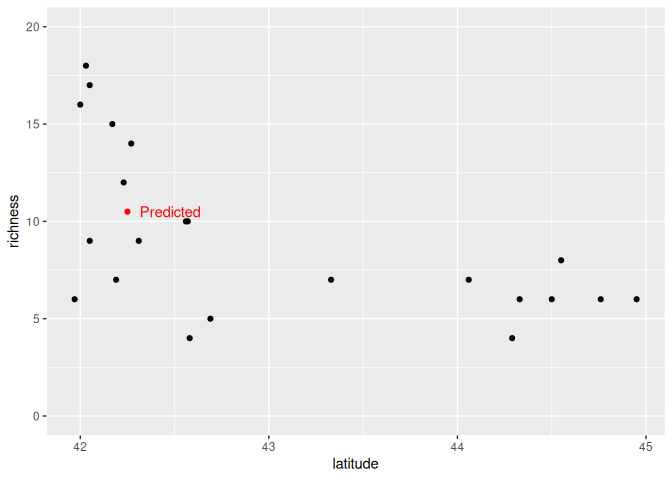
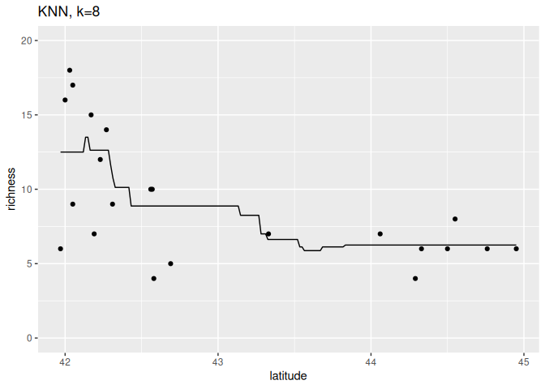
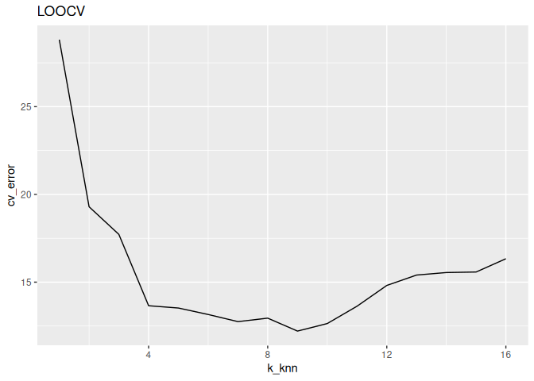
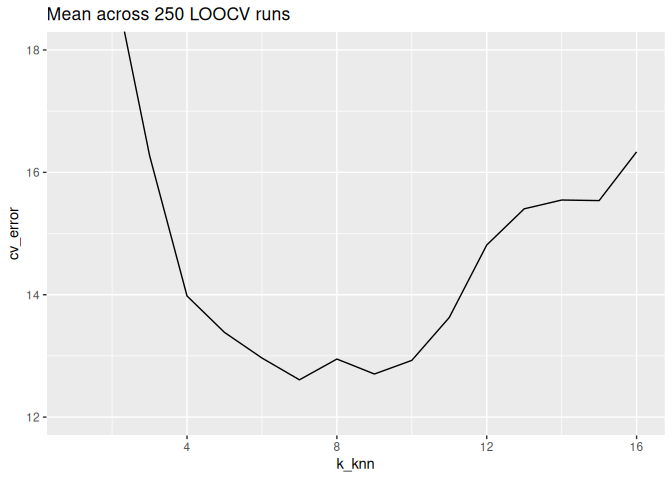

Ant data: k nearest neighbors model algorithm
================
Brett Melbourne
2022 (updated 20 Jan 2026)

KNN for the regression case illustrated with the ants data. This code is
much the same as `ants_cv_polynomial.R` but instead of using a
polynomial as the model algorithm we use KNN.

``` r
library(ggplot2)
library(dplyr)
library(tidyr)
source("source/random_partitions.R") #Function is now in our custom library
```

Forest ant data:

``` r
forest_ants <- read.csv("data/ants.csv") |> 
    filter(habitat=="forest")
```

## Model algorithm

K Nearest Neighbors (KNN) algorithm for 1 new value of x, translating
our pseudocode to R code.

``` r
# Set k = number of nearest neighbors
k <- 4

# Input (x, y) = x, y data pairs
x <- forest_ants$latitude
y <- forest_ants$richness

# Input x_new = x value at which to predict y_new
x_new <- 42.25

# Calculate d = distance of x_new to other x 
d <- abs(x - x_new)
 
# Sort y data ascending by d; break ties randomly
y_sort <- y[order(d, sample(1:length(d)))]

# Predict new y = mean of k nearest y data
y_pred <- mean(y_sort[1:k])
```

The predicted value for richness of 10.5 makes sense.

``` r
y_pred
```

    ## [1] 10.5

``` r
forest_ants |> 
    ggplot() +
    geom_point(aes(x=latitude, y=richness)) +
    annotate("point", x=x_new, y=y_pred, col="red") +
    annotate("text", x=x_new, y=y_pred, label="Predicted", col="Red", hjust=-0.2) +
    coord_cartesian(ylim=c(0,20))
```

<!-- -->

Now as a function that can accept a vector of new x values and return a
vector of predictions.

``` r
# KNN function for a vector of x_new
# x:       x data (vector, numeric)
# y:       y data (vector, numeric)
# x_new:   x values at which to predict y (vector, numeric)
# k:       number of nearest neighbors to average (scalar, integer)
# return:  predicted y at x_new (vector, numeric)
#
knn <- function(x, y, x_new, k) {
    y_pred <- NA * x_new
    for ( i in 1:length(x_new) ) {
    #   Distance of x_new to other x
        d <- abs(x - x_new[i])
    #   Sort y ascending by d; break ties randomly
        y_sort <- y[order(d, sample(1:length(d)))]
    #   Mean of k nearest y data
        y_pred[i] <- mean(y_sort[1:k])
    }
    return(y_pred)
}
```

Test the output of the knn function.

``` r
knn(forest_ants$latitude, forest_ants$richness, x_new=42:45, k=4)
```

    ## [1] 14.25  6.50  5.75  6.50

Plot. Use this block of code to try different values of k
(i.e. different numbers of nearest neighbors).

``` r
k <- 8
grid_latitude  <- seq(min(forest_ants$latitude), max(forest_ants$latitude), length.out=201)
pred_richness <- knn(forest_ants$latitude, forest_ants$richness, x_new=grid_latitude, k=k)
preds <- data.frame(grid_latitude, pred_richness)

forest_ants |> 
    ggplot() +
    geom_point(aes(x=latitude, y=richness)) +
    geom_line(data=preds, aes(x=grid_latitude, y=pred_richness)) +
    coord_cartesian(ylim=c(0,20)) +
    labs(title=paste0("KNN, k=", k))
```

<!-- -->

## Inference algorithm

We’ll do LOOCV (since it’s a small dataset). Be careful not to confuse
the k’s! There is the k-fold k and the KNN k.

``` r
# Function to perform k-fold CV for the KNN model algorithm on ants data
# forest_ants: forest ants dataset (dataframe)
# k_cv:    number of folds (scalar, integer)
# k_knn:   number of nearest neighbors to average (scalar, integer)
# return:  CV error as RMSE (scalar, numeric)
#
cv_knn_ants <- function(forest_ants, k_cv, k_knn) {
    forest_ants$partition <- random_partitions(nrow(forest_ants), k_cv)
    e <- rep(NA, k_cv)
    for ( i in 1:k_cv ) {
        test_data <- subset(forest_ants, partition == i)
        train_data <- subset(forest_ants, partition != i)
        pred_richness <- knn(train_data$latitude, 
                             train_data$richness, 
                             x_new=test_data$latitude, 
                             k=k_knn)
        e[i] <- mean((test_data$richness - pred_richness) ^ 2)
    }
    cv_error <- mean(e)
    return(cv_error)
}
```

Test/use the function

``` r
cv_knn_ants(forest_ants, k_cv=22, k_knn=7) #LOOCV
```

    ## [1] 12.4833

Explore a grid of values for k_knn (we’ll set k_cv as LOOCV only)

``` r
grid <- expand.grid(k_cv=nrow(forest_ants), k_knn=1:16)
grid
```

    ##    k_cv k_knn
    ## 1    22     1
    ## 2    22     2
    ## 3    22     3
    ## 4    22     4
    ## 5    22     5
    ## 6    22     6
    ## 7    22     7
    ## 8    22     8
    ## 9    22     9
    ## 10   22    10
    ## 11   22    11
    ## 12   22    12
    ## 13   22    13
    ## 14   22    14
    ## 15   22    15
    ## 16   22    16

``` r
cv_error <- rep(NA, nrow(grid))
set.seed(6363) #For reproducible results
for ( i in 1:nrow(grid) ) {
    cv_error[i] <- cv_knn_ants(forest_ants, grid$k_cv[i], grid$k_knn[i])
}
result1 <- cbind(grid, cv_error)
```

Plot the result.

``` r
result1 |> 
    ggplot() +
    geom_line(aes(x=k_knn, y=cv_error)) +
    labs(title="LOOCV")
```

<!-- -->

LOOCV (k_cv = 22) identifies the KNN model with k_knn = 9 nearest
neighbors as having the best predictive performance. But we probably
don’t want to trust a single run of LOOCV, since there is a random
component to breaking ties in the KNN model. Let’s look at LOOCV with
many replicate CV runs to smooth over the randomness in tie breakers.

``` r
grid <- expand.grid(k_cv=22, k_knn=1:16)
grid

reps <- 250
cv_error <- matrix(NA, nrow=nrow(grid), ncol=reps)
set.seed(7419) #For reproducible results in this text
for ( j in 1:reps ) {
    for ( i in 1:nrow(grid) ) {
        cv_error[i,j] <- cv_knn_ants(forest_ants, grid$k_cv[i], grid$k_knn[i])
    }
    print(j) #monitor
}
result2 <- cbind(grid, cv_error)
result2$mean_cv <- rowMeans(result2[,-(1:2)])
```

Plot the result.

``` r
result2 |>
    select(k_cv, k_knn, mean_cv) |>
    rename(cv_error=mean_cv) |>
    ggplot() +
    geom_line(aes(x=k_knn, y=cv_error)) +
    labs(title=paste("Mean across",reps,"LOOCV runs")) +
    coord_cartesian(ylim=c(12,18))
```

<!-- -->

and print out to see the detailed numbers

``` r
result2 |> 
    arrange(k_cv) |> 
    select(k_cv, k_knn, mean_cv)
```

    ##    k_cv k_knn  mean_cv
    ## 1    22     1 27.59273
    ## 2    22     2 19.29545
    ## 3    22     3 16.27576
    ## 4    22     4 13.97952
    ## 5    22     5 13.38419
    ## 6    22     6 12.96566
    ## 7    22     7 12.60940
    ## 8    22     8 12.94886
    ## 9    22     9 12.70417
    ## 10   22    10 12.92715
    ## 11   22    11 13.62847
    ## 12   22    12 14.81282
    ## 13   22    13 15.40425
    ## 14   22    14 15.54777
    ## 15   22    15 15.53842
    ## 16   22    16 16.33452

We see LOOCV averaged over multiple runs picks k_knn = 7 as the model
with the best predictive accuracy. Had we relied on a single run of
LOOCV, which identified k_knn = 9, we would still have made a good
choice for k_knn since the models have similar performance.
Interestingly, there is a bump in the error at k_knn = 8. This is most
likely an artifact of the small dataset, so k_knn = 8 is likely also a
very good choice.

What about compared to our other models? Which has the best predictive
performance? Collating the results from our CV inference algorithms, we
have the following estimated MSEs:

| Model              | LOOCV |
|--------------------|-------|
| Polynomial 2       | 12.88 |
| Smoothing spline 3 | 12.52 |
| KNN 7              | 12.61 |
| KNN 9              | 12.70 |

We see that LOOCV gives the edge to the smoothing spline model.
Nevertheless, for these data any of these models has about the same
predictive performance. It is worth noting that a single run of LOOCV
would have picked KNN 9 as the best model with LOOCV = 12.21; this
illustrates that one should be wary whenever randomness is involved,
whether in the model, training, or inference algorithm.
