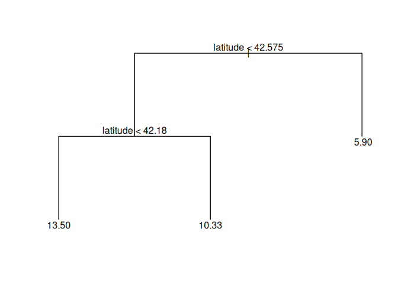
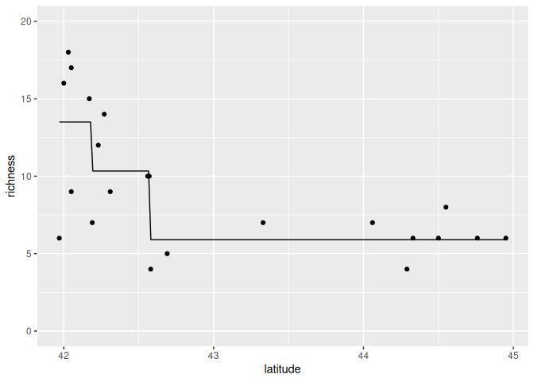
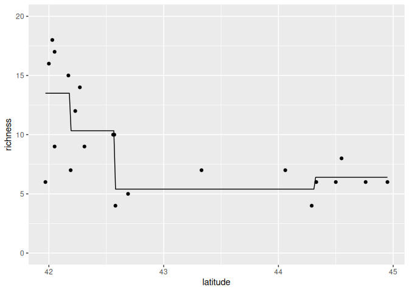
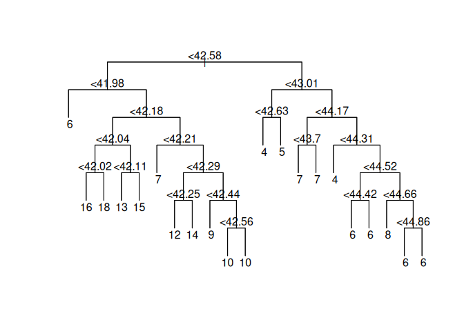
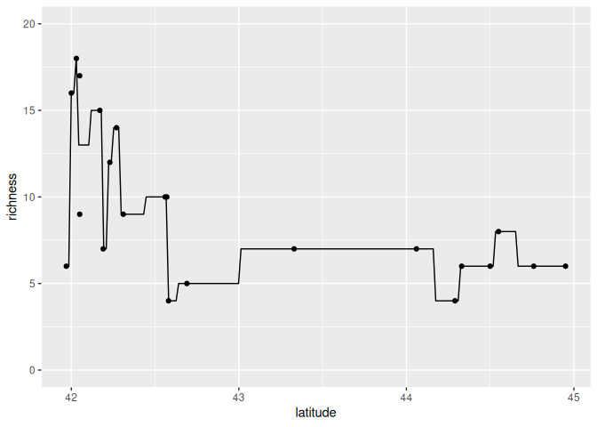
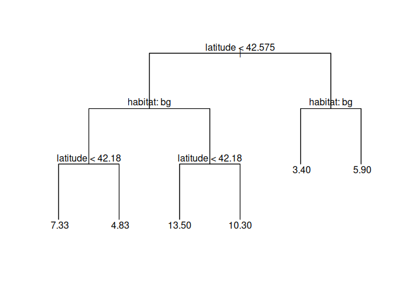
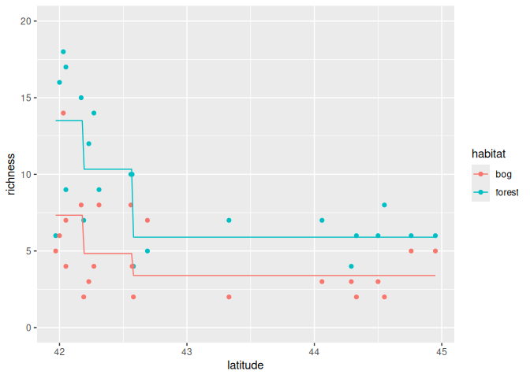
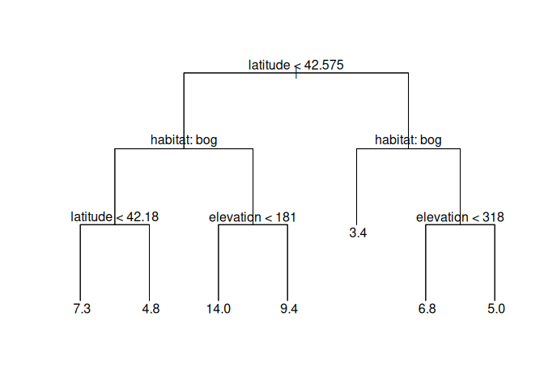
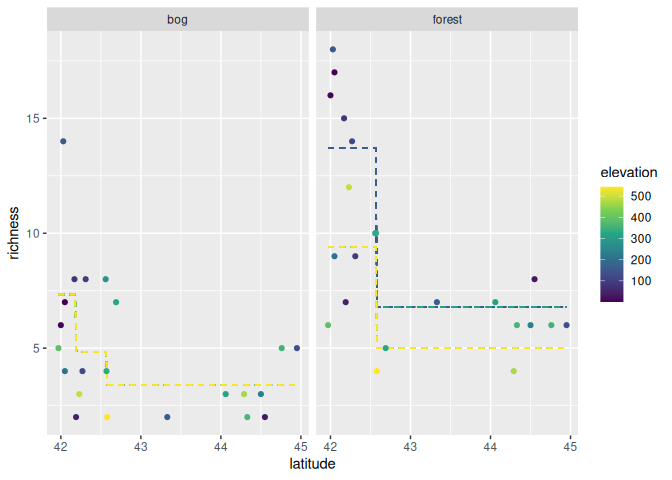
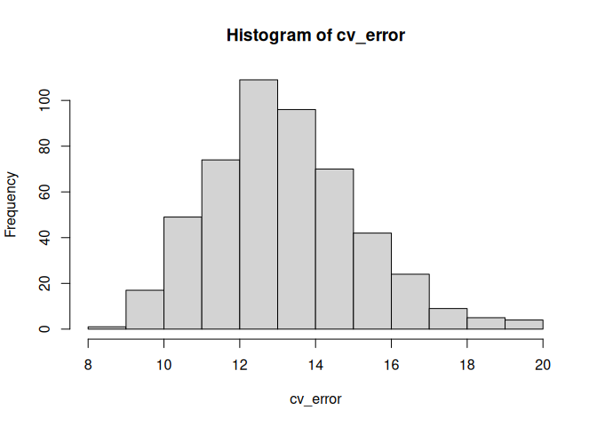

Ant data: decision trees
================
Brett Melbourne
9 Feb 2024

Decision trees for the regression case illustrated with the ants data.
We start with a regression tree for a single predictor variable, then
look at regression trees with multiple predictors.

``` r
library(ggplot2)
library(dplyr)
library(tree)
source("source/random_partitions.R") #Function is now in our custom library
source("source/tree_helper_functions.R") #Other functions for using trees
```

It has become clear that we are repeatedly using our
`random_partitions()` function and haven’t needed to change it. So, we
could make that the beginning of a collection of regularly used
functions and `source()` it instead. I added a `source` directory to the
project and put the function in a file there called
`random_partitions.R`. We can read the function in using the `source()`
function, which I added at the top of this script. To illustrate the
tree algorithms I’ve also added some helper functions that do things
like convert data structures and plot trees.

Forest ant data:

``` r
forest_ants <- read.csv("data/ants.csv") |> 
    filter(habitat=="forest") |> 
    select(latitude, richness)
```

## Overview

Before we look at the algorithms in detail, we’ll start by using the
`tree()` function in the `tree` package. Using this package we’ll first
train the model, visualize the regression tree, and use it to make
predictions of species richness.

``` r
tree_trained <- tree(richness ~ latitude, data=forest_ants)
plot(tree_trained, type="uniform")
text(tree_trained, pretty=0)
```

<!-- -->

We see that the tree splits latitude twice, first at 42.575 then at
42.18 to give three terminal nodes. The predicted richness is at the end
of the terminal nodes. To make predictions, the model algorithm simply
follows the branches of the tree evaluating decisions. We start at the
top of the decision tree and work down. For example, say we want to
predict species richness for latitude 42.4. At the first decision node,
42.4 is less than 42.575, so we follow the left branch to another
decision node. At this node, we find that 42.4 is greater than 42.18, so
we follow the right branch, to a terminal node, which gives the
prediction of 10 species.

Plot predictions across a grid of latitude values and compare with the
data:

``` r
grid_latitude  <- seq(min(forest_ants$latitude), max(forest_ants$latitude), 
                      length.out=201)
grid_data <- data.frame(latitude=grid_latitude)
preds <- cbind(grid_data, richness=predict(tree_trained, newdata=grid_data))
forest_ants |> 
    ggplot() +
    geom_point(aes(x=latitude, y=richness)) +
    geom_line(data=preds, aes(x=latitude, y=richness)) +
    coord_cartesian(ylim=c(0,20))
```

<!-- -->

We see that for a single predictor variable, a regression tree
partitions the predictor (x axis) into segments (three segments in this
case). We are modeling any patterns or nonlinearities in the data as a
step function for which we can control the resolution (the number of
partitions) through the parameters of the tree algorithm.

## Close look at algorithms

### Training algorithm

Now let’s look at the algorithms by building them from scratch. We’ll
look at the **training algorithm** first. This algorithm is called
binary recursive partitioning.

    # Binary recursive partitioning
    define build_tree(y,x) {
        if stop = TRUE
            calculate prediction (mean of y)
        else
            find x_split #best x to split the data
            build_tree( (y,x)[x < x_split] ) #L branch
            build_tree( (y,x)[x >= x_split] ) #R branch
    }

The algorithm is recursive because `build_tree()` is a function and it
calls itself repeatedly in nested function calls until it finally stops
when a stopping rule becomes true. One pass through this function either
establishes a terminal node with a prediction, or a decision node and
two branches.

Here is an R implementation that prints out the tree structure. It has
two stopping rules: stop if the number of points in a partition falls
below n_min, or stop if the branching depth d, exceeds d_max. To split
the data, it calls another function, `best_split()`, (read in using
`source()` above) to determine the best split of the data (the split
that minimizes the SSQ). We’ve added some arguments to allow updating
the depth and node information.

``` r
# Train a decision tree by recursive binary partitioning
# df:     data frame containing columns y, x (numeric)
# n_min:  stopping rule, min number of points in a partition (scalar, integer)
# d_max:  stopping rule, max tree depth (scalar, integer)
# d:      current tree depth, initialized to 1 (scalar, integer)
# node:   current node, initialized to 1 (scalar, integer)
#
# output: prints out the tree structure; no return object
#
build_tree <- function( df, n_min, d_max, d=1, node=1 ) {
#   if stop = TRUE
    if ( nrow(df) < 2 * n_min | d >= d_max ) {
    #   calculate and print prediction (and node info)
        y_pred <- mean(df$y)
        print(paste(node, "leaf", round(y_pred, 2), sep="_"))
    } else {
    #   find the best split of the data
        x_split <- best_split(df, n_min)
    #   print decision node information
        print(paste(node, paste0("<", round(x_split, 2)), sep="_"))
    #   build left branch
        build_tree(df[df$x < x_split,], n_min, d_max, d + 1, 2 * node)
    #   build right branch
        build_tree(df[df$x >= x_split,], n_min, d_max, d + 1, 2 * node + 1)
    }
}
```

Now using this function with some generated data

``` r
set.seed(783)
x <- runif(100, -5, 5)
y <- rnorm(100, mean=100 + x - x ^ 2, sd=10)
x <- x + 5
df <- data.frame(x, y)
build_tree(df, n_min=5, d_max=3)
```

    ## [1] "1_<3.01"
    ## [1] "2_<2.06"
    ## [1] "4_leaf_79.17"
    ## [1] "5_leaf_87.68"
    ## [1] "3_<8.32"
    ## [1] "6_leaf_97.62"
    ## [1] "7_leaf_86.47"

The printout shows a line for each node (identified by an integer index)
and either the decision criterion (for a decision node), or the
prediction (for a leaf node). Thus, here node 1 says if x \< 3.01, take
the left branch. In a binary tree, there is a scheme for numbering the
nodes so we know which node is connected to which. The node on the left
child branch is

$$
node_{Lchild} = 2 node_{parent}
$$

while the node on the right child branch is

$$
node_{Rchild} = 2 node_{parent} + 1
$$

So, the left branch leads to node 2. In the table above, we see that
node 2 is again a decision node, with its left branch terminating at
leaf node 4 with a prediction of 79.17. There are 3 splits (decision
nodes), and four leaves (terminal nodes), so the training algorithm has
partitioned the data into 4 chunks.

The code we just used shows the general principle. To use the algorithm,
we need to add data structures to collect the data, and another stopping
rule that ensures that we stop if there is no variation in x within a
group.

``` r
# Train a decision tree by recursive binary partitioning
# df:     data frame containing columns y, x (numeric)
# n_min:  stopping rule, min number of points in a partition (scalar, integer)
# d_max:  stopping rule, max tree depth (scalar, integer)
# d:      current tree depth, initialized to 1 (scalar, integer)
# node:   current node, initialized to 1 (scalar, integer)
#
# return: structure of the current and child nodes (data frame)
#
build_tree <- function( df, n_min, d_max, d=1, node=1 ) {
#   if stop = TRUE
    stop1 <- nrow(df) < 2 * n_min  #partition size
    stop2 <- d >= d_max            #max depth
    stop3 <- var(df$x) == 0        #can't split if no variance
    if ( stop1 | stop2 | stop3 ) {
    #   calculate and record prediction
        y_pred <- mean(df$y)
        result <- data.frame(node=node, type="leaf", split=NA, y_pred=y_pred)
    } else {
    #   find the best split of the data
        x_split <- best_split(df, n_min)
    #   record decision node and child branch information
        this_node <- data.frame(node=node, type="split", split=x_split, y_pred=NA)
    #   build left branch
        L_branch <- build_tree(df[df$x < x_split,], n_min, d_max, d + 1, 2 * node)
    #   build right branch
        R_branch <- build_tree(df[df$x >= x_split,], n_min, d_max, d + 1, 2 * node + 1)
        result <- rbind(this_node, L_branch, R_branch)
    }
    return(result)
}
```

To use this training algorithm with the ants data, we’ll rename columns,
as the `build_tree()` function requires the names “x” and “y”. To do
that, we’ll make a “wrapper” function. This also names the function with
a similar convention to our previously named function and it’s clear
that this is a training algorithm.

``` r
train_tree <- function( df, n_min, d_max=5 ) {
    df <- df |> rename(x=latitude, y=richness)
    build_tree( df, n_min, d_max )
}
```

Now train and plot the tree model on the ants data. Let’s try a tree
with stopping rules of minimum partition size of 4 and maximum depth of
3.

``` r
tree_trained <- train_tree(forest_ants, n_min=4, d_max=3)
plot_tree(tree_trained)
```

<!-- -->

We see that the training algorithm has partitioned the data into 4
chunks and the resulting tree is 3 nodes deep.

### Model algorithm

The model consists of a representation of the tree structure in a data
frame, along with an algorithm to process the decisions and extract the
prediction. Here is the tree structure:

``` r
tree_trained
```

    ##   node  type  split   y_pred
    ## 1    1 split 42.575       NA
    ## 2    2 split 42.180       NA
    ## 3    4  leaf     NA 13.50000
    ## 4    5  leaf     NA 10.33333
    ## 5    3 split 44.310       NA
    ## 6    6  leaf     NA  5.40000
    ## 7    7  leaf     NA  6.40000

The tree structure is represented by a data frame with a row for each
node and 4 columns: the node identity, the type of node, the split
(decision criterion), and the predicted value of y (richness in the case
of the ants dataset).

Here is one algorithm for processing the decisions and returning the
prediction. This algorithm navigates the decision tree until it arrives
at a leaf node, which contains the prediction.

    # Predict y from x
    start at the root node
    while node type is split
        if x < split value at the node
            take left branch to next node
        else
            take right branch to next node
    return predicted y at node

Turning this pseudocode into R code:

``` r
# Return predicted y for a single x value from a tree
#
# t: tree in row index form (data frame)
# x: value of x (scalar, numeric)
#
predict_tree_x <- function( t, x ) {
    node <- 1 #start at root node
    while ( t$type[node] == "split" ) {
        if ( x < t$split[node] ) {
        #   Take left branch
            node <- 2 * node
        } else {
        #   Take right branch
            node <- 2 * node + 1
        }
    }
    return(t$y_pred[node])
}
```

Row index form is the nodes arranged in rows such that node i is located
in row i. This makes the algorithm more efficient because we don’t need
to search for the node in the table, we already know which row it is in.
There is a helper function to convert the tree data frame to row index
form. Here is what row index form looks like.

``` r
tree_trained_ri <- to_row_index_tree(tree_trained)
tree_trained_ri
```

    ##   node  type  split   y_pred
    ## 1    1 split 42.575       NA
    ## 2    2 split 42.180       NA
    ## 3    3 split 44.310       NA
    ## 4    4  leaf     NA 13.50000
    ## 5    5  leaf     NA 10.33333
    ## 6    6  leaf     NA  5.40000
    ## 7    7  leaf     NA  6.40000

It’s just the 7 nodes in their respective rows. To use the model
algorithm to predict richness at latitude 42.3:

``` r
predict_tree_x(tree_trained_ri, 42.3)
```

    ## [1] 10.33333

Now add a repetition structure (here we use a `for` loop) to process a
vector of x values instead of just a single value. This function calls
`predict_tree_x()` for each value of x to extract the predicted y.

``` r
# Function to output predicted y values from a tree
# tree:  tree structure from a call to build_tree (data frame)
# x_new: x values for which to make a prediction (vector, numeric)
#
# return: predicted y values (vector, numeric)
#
predict_tree <- function( tree, x_new ) {
    t <- to_row_index_tree(tree)
    nx <- length(x_new)
    y_pred <- rep(NA, nx)
    for ( i in 1:nx ) {
        y_pred[i] <- predict_tree_x(t, x_new[i])
    }
    return(y_pred)
}
```

Now we can use this function to plot predictions with the data:

``` r
grid_latitude <- seq(min(forest_ants$latitude), max(forest_ants$latitude), 
                     length.out=201)
preds <- data.frame(latitude=grid_latitude, 
                    richness=predict_tree(tree_trained, x_new=grid_latitude))
forest_ants |> 
    ggplot() +
    geom_point(aes(x=latitude, y=richness)) +
    geom_line(data=preds, aes(x=latitude, y=richness)) +
    coord_cartesian(ylim=c(0,20))
```

<!-- -->

In contrast, the following code trains a deeper tree. We have modified
the stopping rules of the training algorithm to allow splits all the way
to individual data points.

``` r
tree_trained <- train_tree(forest_ants, n_min=1, d_max=8)
plot_tree(tree_trained)
```

<!-- -->

``` r
grid_latitude <- seq(min(forest_ants$latitude), max(forest_ants$latitude),
                     length.out=201)
preds <- data.frame(latitude=grid_latitude,
                    richness=predict_tree(tree_trained, x_new=grid_latitude))
forest_ants |> 
    ggplot() +
    geom_point(aes(x=latitude, y=richness)) +
    geom_line(data=preds, aes(x=latitude, y=richness)) +
    coord_cartesian(ylim=c(0,20))
```

<!-- -->

For this tree the predictions follow the data except for the one case
where two data points shared the same latitude.

## Multiple variables, mixed types

Now that we’ve examined the algorithms in some detail, we’ll switch back
to using the `tree` package. The functions above demonstrate the
fundamental algorithms but we’d need to add more code to handle multiple
variables, categorical x variables, and the classification case. The
`tree()` function from the `tree` package handles all of this. In its
training algorithm, it has default stopping rules that include the
number of observations in nodes and the variance within nodes.

There is more data in the ants dataset, including two more predictor
variables: habitat (bog or forest) and elevation (m).

``` r
ants <- read.csv("data/ants.csv") |> 
    select(-site) |> 
    mutate_if(is.character, factor)
head(ants)
```

    ##   habitat latitude elevation richness
    ## 1  forest    41.97       389        6
    ## 2  forest    42.00         8       16
    ## 3  forest    42.03       152       18
    ## 4  forest    42.05         1       17
    ## 5  forest    42.05       210        9
    ## 6  forest    42.17        78       15

Here, we have converted habitat to a factor, which is R’s data structure
for a categorical variable and is required for input to the `tree()`
function. Train a tree that includes two of these variables, latitude
and habitat, as predictors:

``` r
tree_trained <- tree(richness ~ latitude + habitat, data=ants)
plot(tree_trained, type="uniform")
text(tree_trained, pretty=2, digits=3)
```

<!-- -->

We see the tree has nodes that split at both predictor variables. First
it splits by latitude, then it splits by habitat, then it splits by
latitude again. At the habitat nodes, bog is to the left while forest is
to the right.

Plot the prediction from the trained model

``` r
grid_data  <- expand.grid(
    latitude=seq(min(ants$latitude), max(ants$latitude), length.out=201),
    habitat=factor(c("forest","bog")))
preds <- cbind(grid_data, richness=predict(tree_trained, newdata=grid_data))
ants |> 
    ggplot() +
    geom_point(aes(x=latitude, y=richness, col=habitat)) +
    geom_line(data=preds, aes(x=latitude, y=richness, col=habitat)) +
    coord_cartesian(ylim=c(0,20))
```

<!-- -->

Plotting the predicted richness reveals that we have effectively modeled
richness as a nonlinear combination, or “interaction”, of habitat and
latitude. The stepwise functions broadly (arguably crudely) capture the
pattern of a slightly different nonlinear relationship between richness
and latitude in each habitat.

Now train a tree with all three predictor variables:

``` r
tree_trained <- tree(richness ~ latitude + habitat + elevation, data=ants)
plot(tree_trained, type="uniform")
text(tree_trained, pretty=0, digits=2)
```

<!-- -->

This tree has splits for all three predictor variables. First it splits
by latitude, then by habitat, and then it splits again by elevation in
forest habitat only. One interpretation is that elevation helps to
predict richness only in forest.

It’s harder to visualize the prediction from this trained model since we
have multiple predictor dimensions. Here is one visualizaton:

``` r
grid_data  <- expand.grid(
    latitude=seq(min(ants$latitude), max(ants$latitude), length.out=201),
    habitat=factor(c("forest","bog")),
    elevation=seq(min(ants$elevation), max(ants$elevation), length.out=51))
preds <- cbind(grid_data, richness=predict(tree_trained, newdata=grid_data))
ants |> 
    ggplot() +
    geom_line(data=preds, 
              aes(x=latitude, y=richness, col=elevation, group=factor(elevation)),
              linetype=2) +
    geom_point(aes(x=latitude, y=richness, col=elevation)) +
    facet_wrap(vars(habitat)) +
    scale_color_viridis_c()
```

<!-- -->

The plot shows that elevation doesn’t contribute to prediction in the
bog habitat but we’re modeling different nonlinearities in the forest
habitat for lower and higher elevations. Effectively we are crudely
modeling the interaction between habitat, latitude, and elevation by
dividing the predictor space into 7 chunks. Since our goal is prediction
we’d be most interested in plotting predictions within some region to
make a map of predicted species richness for the area from which the
data came. For that we’d need maps of the predictor variables but such a
visualization scales to any number of predictor variables.

### Inference algorithm

As usual, the prediction error (i.e. the out-of-sample error) from a
regression tree can be estimated by k-fold cross validation just as we
have done for other models.

``` r
# Function to perform k-fold CV for the tree model on ants data
# k:       number of partitions (scalar, integer)
# return:  CV error as MSE (scalar, numeric)
#
cv_tree_ants <- function(ants, k) {
    ants$partition <- random_partitions(nrow(ants), k)
    e <- rep(NA, k)
    for ( i in 1:k ) {
        test_data <- subset(ants, partition == i)
        train_data <- subset(ants, partition != i)
        train_tree <- tree(richness ~ latitude + habitat + elevation, data=train_data)
        pred_richness <- predict(train_tree, newdata=test_data)
        e[i] <- mean((test_data$richness - pred_richness) ^ 2)
    }
    cv_error <- mean(e)
    return(cv_error)
}
```

Test the function

``` r
cv_tree_ants(ants, k=5)
```

    ## [1] 13.32096

``` r
cv_tree_ants(ants, k=nrow(ants)) #LOOCV
```

    ## [1] 12.68253

Running the above two lines of code multiple times we find lots of
variability in the prediction error estimate for 5-fold CV due to the
randomness of the partitions. LOOCV does not change because the tree
model and training algorithms are deterministic. As before, we’ll need
repeated partitions for a more stable estimate of the 5-fold CV:

``` r
set.seed(3127)
reps <- 500
cv_error <- rep(NA, reps)
for ( i in 1:reps ) {
    cv_error[i] <- cv_tree_ants(ants, k=5)
}
```

A histogram suggests the CV replicates are well behaved

``` r
hist(cv_error)
```

<!-- -->

Estimated error and its Monte Carlo error (about +/- 0.1)

``` r
mean(cv_error)
```

    ## [1] 13.15425

``` r
sd(cv_error) / sqrt(reps)
```

    ## [1] 0.08818662
