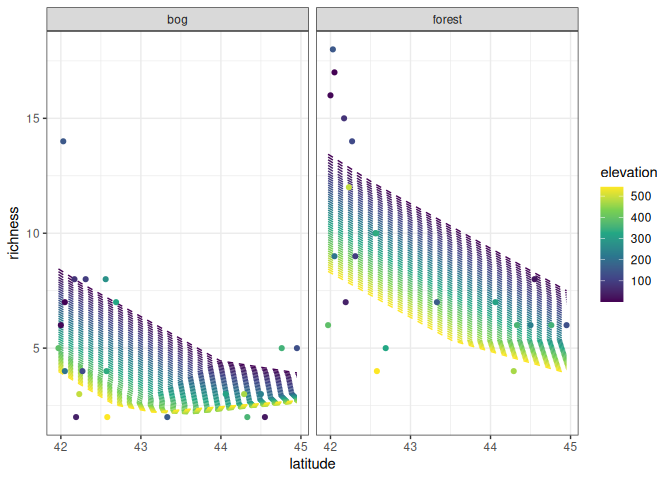

Ant data: neural network
================
Brett Melbourne
27 Feb 2024

A single layer neural network, or feedforward network, illustrated with
the ants data. We first hand code the model algorithm as a proof of
understanding. Then we code the same model and train it using Keras.

``` r
library(ggplot2)
library(dplyr)
```

Ant data with 3 predictors of species richness

``` r
ants <- read.csv("data/ants.csv") |> 
    select(richness, latitude, habitat, elevation)
head(ants)
```

    ##   richness latitude habitat elevation
    ## 1        6    41.97  forest       389
    ## 2       16    42.00  forest         8
    ## 3       18    42.03  forest       152
    ## 4       17    42.05  forest         1
    ## 5        9    42.05  forest       210
    ## 6       15    42.17  forest        78

For neural networks it is customary to scale numeric predictors to zero
mean, unit variance, as the training algorithms perform better. To make
predictions with new data, we need to use the scaling parameters from
the data used to train the model. Here, we calculate the scaling
parameters (mean and standard deviation) to use later.

``` r
lat_mn <- mean(ants$latitude)
lat_sd <- sd(ants$latitude)
ele_mn <- mean(ants$elevation)
ele_sd <- sd(ants$elevation)
```

### Hand-coded feedforward network

Before we go on to Keras, we’re going to hand code a feedforward network
in R to gain a good understanding of the model algorithm. Here is our
pseudocode from the lecture notes.

    Single layer neural network, model algorithm:

    define g(z)
    load X, i=1...n, j=1...p (in appropriate form)
    set K
    set weights and biases: w(1)_jk, b(1)_k, w(2)_k1, b(2)_1
    for each activation unit k in 1:K
        calculate linear predictor: z_k = b(1)_k + Xw(1)_k
        calculate nonlinear activation: A_k = g(z_k)
    calculate linear model: f(X) = b(2)_1 + Aw(2)_1
    return f(X)

Now code this algorithm in R. I already trained this model using Keras
(see later) to obtain a parameter set for the weights and biases.

``` r
# Single layer neural network, model algorithm

# define g(z)
g_relu <- function(z) {
    g_z <- ifelse(z < 0, 0, z)
    return(g_z)
}

# load x (could be a grid of new predictor values or the original data)
grid_data  <- expand.grid(
    latitude=seq(min(ants$latitude), max(ants$latitude), length.out=201),
    habitat=c("forest","bog"),
    elevation=seq(min(ants$elevation), max(ants$elevation), length.out=51))

# data preparation: scale, one-hot encoding, convert to matrix
x <- grid_data |>
    mutate(latitude = (latitude - lat_mn) / lat_sd,
           elevation = (elevation - ele_mn) / ele_sd,
           bog = ifelse(habitat == "bog", 1, 0),
           forest = ifelse(habitat == "forest", 1, 0)) |>    
    select(latitude, bog, forest, elevation) |>     #drop richness & habitat
    as.matrix()

# dimensions of x
n <- nrow(x)
p <- ncol(x)

# set K (number of nodes in the hidden layer)
K <- 5

# set parameters (weights and biases)
w1 <- c(-0.2514450848, 0.4609818,  0.1607399, -0.9136779, -1.0339828,
        -0.4243144095, 0.7681985, -0.1529205, -0.3439012,  0.8026423,
        -0.0005548226, 0.6407318,  1.4387618,  1.6372939,  1.1695395,
        -0.0395327508, 0.5222837, -0.6239772, -0.3365386, -0.7156096) |>
    matrix(nrow=4, ncol=5, byrow=TRUE)

b1 <- c(-0.2956778, 0.3149067, 0.8800480, 0.6910487, 0.6947369)

w2 <- c(-0.4076283,
         0.6379358,
         0.8768858,
         1.6320601,
         0.9864114) |> 
    matrix(nrow=5, ncol=1, byrow=TRUE)

b2 <- 0.8487959


# hidden layer 1, iterating over each activation unit
A <- matrix(NA, nrow=n, ncol=K)
for ( k in 1:K ) {
#   linear predictor
    z <- x %*% w1[,k] + b1[k]
#   nonlinear activation
    A[,k] <- g_relu(z)
}

# output, layer 2, linear model
f_x <- A %*% w2  + b2

# return f(x); a redundant copy but mirrors our previous examples
nn1_preds <- f_x
```

Plot predictions

``` r
preds <- cbind(grid_data, richness=nn1_preds)
ants |> 
    ggplot() +
    geom_line(data=preds, 
              aes(x=latitude, y=richness, col=elevation, group=factor(elevation)),
              linetype=2) +
    geom_point(aes(x=latitude, y=richness, col=elevation)) +
    facet_wrap(vars(habitat)) +
    scale_color_viridis_c() +
    theme_bw()
```

<!-- -->
