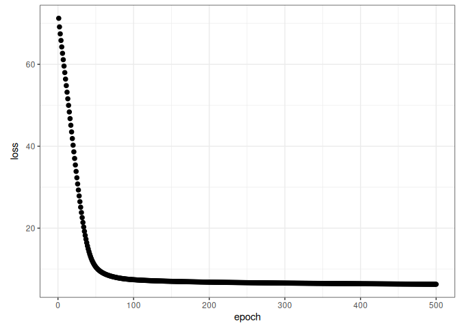
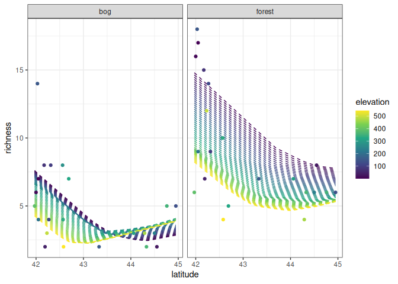
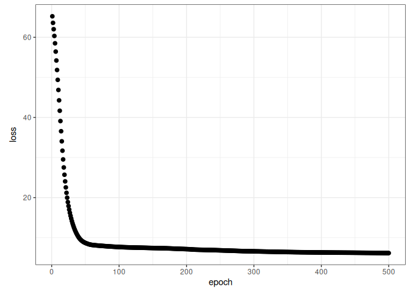
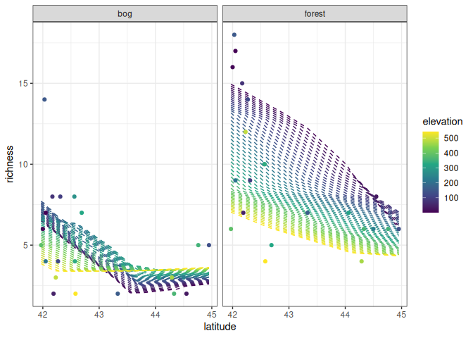

Ant data: neural network architectures
================
Brett Melbourne
28 Feb 2024 (updated 19 Feb 2026)

Different neural network architectures illustrated with the ants data
using Keras (tensorflow). We compare a wide to a deep architecture.

It’s important to note that it isn’t sensible to fit these 151 parameter
models to our small dataset of 44 data points without a lot of
regularization and of course tuning and k-fold cross validation, the
latter of which would add so much computation that it’s not worth it.
This code is to illustrate the effect of different architectures and for
comparison to the previous machine learning approaches we have used with
this small dataset.

``` r
library(ggplot2)
library(dplyr)
library(keras3)
library(rgl) #3D plotting
```

Ant data with 3 predictors of species richness

``` r
ants <- read.csv("data/ants.csv") |> 
    select(richness, latitude, habitat, elevation)
head(ants)
```

    ##   richness latitude habitat elevation
    ## 1        6    41.97  forest       389
    ## 2       16    42.00  forest         8
    ## 3       18    42.03  forest       152
    ## 4       17    42.05  forest         1
    ## 5        9    42.05  forest       210
    ## 6       15    42.17  forest        78

Scaling parameters

``` r
lat_mn <- mean(ants$latitude)
lat_sd <- sd(ants$latitude)
ele_mn <- mean(ants$elevation)
ele_sd <- sd(ants$elevation)
```

Prepare the data and a set of new x to predict

``` r
xtrain <- ants |> 
    mutate(latitude = (latitude - lat_mn) / lat_sd,
           elevation = (elevation - ele_mn) / ele_sd,
           bog = ifelse(habitat == "bog", 1, 0),
           forest = ifelse(habitat == "forest", 1, 0)) |>    
    select(latitude, bog, forest, elevation) |>     #drop richness & habitat
    as.matrix()

ytrain <- ants[,"richness"]

grid_data  <- expand.grid(
    latitude=seq(min(ants$latitude), max(ants$latitude), length.out=201),
    habitat=c("forest","bog"),
    elevation=seq(min(ants$elevation), max(ants$elevation), length.out=51))

x <- grid_data |>
    mutate(latitude = (latitude - lat_mn) / lat_sd,
           elevation = (elevation - ele_mn) / ele_sd,
           bog = ifelse(habitat == "bog", 1, 0),
           forest = ifelse(habitat == "forest", 1, 0)) |>    
    select(latitude, bog, forest, elevation) |>     #drop richness & habitat
    as.matrix()
```

A wide model with 25 units

``` r
tensorflow::set_random_seed(6590)
modnn2 <- keras_model_sequential(input_shape = ncol(xtrain)) |>
    layer_dense(units = 25) |>
    layer_activation("relu") |> 
    layer_dense(units = 1)
modnn2
```

    ## Model: "sequential"
    ## ┏━━━━━━━━━━━━━━━━━━━━━━━━━━━━━━━━━━━┳━━━━━━━━━━━━━━━━━━━━━━━━━━┳━━━━━━━━━━━━━━━┓
    ## ┃ Layer (type)                      ┃ Output Shape             ┃       Param # ┃
    ## ┡━━━━━━━━━━━━━━━━━━━━━━━━━━━━━━━━━━━╇━━━━━━━━━━━━━━━━━━━━━━━━━━╇━━━━━━━━━━━━━━━┩
    ## │ dense (Dense)                     │ (None, 25)               │           125 │
    ## ├───────────────────────────────────┼──────────────────────────┼───────────────┤
    ## │ activation (Activation)           │ (None, 25)               │             0 │
    ## ├───────────────────────────────────┼──────────────────────────┼───────────────┤
    ## │ dense_1 (Dense)                   │ (None, 1)                │            26 │
    ## └───────────────────────────────────┴──────────────────────────┴───────────────┘
    ##  Total params: 151 (604.00 B)
    ##  Trainable params: 151 (604.00 B)
    ##  Non-trainable params: 0 (0.00 B)

``` r
compile(modnn2, optimizer="rmsprop", loss="mse")
fit(modnn2, xtrain, ytrain, epochs = 500, batch_size=4) -> history
```

``` r
# Ensure the "/saved" directory exists before running the next line
# save_model(modnn2, "07_6_ants_nnet_architecture_files/saved/modnn2.keras")
# save(history, file="07_6_ants_nnet_architecture_files/saved/modnn2_history.Rdata")
modnn2 <- load_model("07_6_ants_nnet_architecture_files/saved/modnn2.keras")
load("07_6_ants_nnet_architecture_files/saved/modnn2_history.Rdata")
```

``` r
plot(history, smooth=FALSE, theme_bw=TRUE)
```

<!-- -->

``` r
npred <- predict(modnn2, x)
```

    ## 641/641 - 0s - 646us/step

``` r
preds <- cbind(grid_data, richness=npred)
ants |> 
    ggplot() +
    geom_line(data=preds, 
              aes(x=latitude, y=richness, col=elevation, group=factor(elevation)),
              linetype=2) +
    geom_point(aes(x=latitude, y=richness, col=elevation)) +
    facet_wrap(vars(habitat)) +
    scale_color_viridis_c() +
    theme_bw()
```

<!-- -->

For this wide model, we get quite a flexible fit with a good deal of
nonlinearity and some complexity to the surface (e.g. the fold evident
in the bog surface).

Plot in an interactive 3D environment (using rgl library)

``` r
cols <- ifelse(ants$habitat == "forest", "green", "brown")
plot3d(preds$latitude, preds$elevation, preds$richness)
points3d(ants$latitude, ants$elevation, ants$richness, col=cols)
# rglwidget() #might be needed
```

A deep model with 25 units

``` r
tensorflow::set_random_seed(7855)
modnn3 <- keras_model_sequential(input_shape = ncol(xtrain)) |>
    layer_dense(units = 5) |>
    layer_activation("relu") |>
    layer_dense(units = 5) |>
    layer_activation("relu") |> 
    layer_dense(units = 5) |>
    layer_activation("relu") |> 
    layer_dense(units = 5) |>
    layer_activation("relu") |> 
    layer_dense(units = 5) |>
    layer_activation("relu") |> 
    layer_dense(units = 1)
modnn3
```

    ## Model: "sequential_1"
    ## ┏━━━━━━━━━━━━━━━━━━━━━━━━━━━━━━━━━━━┳━━━━━━━━━━━━━━━━━━━━━━━━━━┳━━━━━━━━━━━━━━━┓
    ## ┃ Layer (type)                      ┃ Output Shape             ┃       Param # ┃
    ## ┡━━━━━━━━━━━━━━━━━━━━━━━━━━━━━━━━━━━╇━━━━━━━━━━━━━━━━━━━━━━━━━━╇━━━━━━━━━━━━━━━┩
    ## │ dense_2 (Dense)                   │ (None, 5)                │            25 │
    ## ├───────────────────────────────────┼──────────────────────────┼───────────────┤
    ## │ activation_1 (Activation)         │ (None, 5)                │             0 │
    ## ├───────────────────────────────────┼──────────────────────────┼───────────────┤
    ## │ dense_3 (Dense)                   │ (None, 5)                │            30 │
    ## ├───────────────────────────────────┼──────────────────────────┼───────────────┤
    ## │ activation_2 (Activation)         │ (None, 5)                │             0 │
    ## ├───────────────────────────────────┼──────────────────────────┼───────────────┤
    ## │ dense_4 (Dense)                   │ (None, 5)                │            30 │
    ## ├───────────────────────────────────┼──────────────────────────┼───────────────┤
    ## │ activation_3 (Activation)         │ (None, 5)                │             0 │
    ## ├───────────────────────────────────┼──────────────────────────┼───────────────┤
    ## │ dense_5 (Dense)                   │ (None, 5)                │            30 │
    ## ├───────────────────────────────────┼──────────────────────────┼───────────────┤
    ## │ activation_4 (Activation)         │ (None, 5)                │             0 │
    ## ├───────────────────────────────────┼──────────────────────────┼───────────────┤
    ## │ dense_6 (Dense)                   │ (None, 5)                │            30 │
    ## ├───────────────────────────────────┼──────────────────────────┼───────────────┤
    ## │ activation_5 (Activation)         │ (None, 5)                │             0 │
    ## ├───────────────────────────────────┼──────────────────────────┼───────────────┤
    ## │ dense_7 (Dense)                   │ (None, 1)                │             6 │
    ## └───────────────────────────────────┴──────────────────────────┴───────────────┘
    ##  Total params: 151 (604.00 B)
    ##  Trainable params: 151 (604.00 B)
    ##  Non-trainable params: 0 (0.00 B)

``` r
compile(modnn3, optimizer="rmsprop", loss="mse")
fit(modnn3, xtrain, ytrain, epochs = 500, batch_size=4) -> history
```

``` r
# save_model(modnn3, "07_6_ants_nnet_architecture_files/saved/modnn3.keras")
# save(history, file="07_6_ants_nnet_architecture_files/saved/modnn3_history.Rdata")
modnn3 <- load_model("07_6_ants_nnet_architecture_files/saved/modnn3.keras")
load("07_6_ants_nnet_architecture_files/saved/modnn3_history.Rdata")
```

``` r
plot(history, smooth=FALSE, theme_bw=TRUE)
```

<!-- -->

``` r
npred <- predict(modnn3, x)
```

    ## 641/641 - 0s - 552us/step

``` r
preds <- cbind(grid_data, richness=npred)
ants |> 
    ggplot() +
    geom_line(data=preds, 
              aes(x=latitude, y=richness, col=elevation, group=factor(elevation)),
              linetype=2) +
    geom_point(aes(x=latitude, y=richness, col=elevation)) +
    facet_wrap(vars(habitat)) +
    scale_color_viridis_c() +
    theme_bw()
```

<!-- -->

The deep model is very “expressive”. It has more complexity to its fit,
for example more folds and bends in the surface, for the same number of
parameters and epochs. You can also see that this model is probably
nonsense overall given the many contortions it is undergoing to fit the
data. It is likely very overfit and unlikely to generalize well.

Plot in an interactive 3D environment

``` r
cols <- ifelse(ants$habitat == "forest", "green", "brown")
plot3d(preds$latitude, preds$elevation, preds$richness)
points3d(ants$latitude, ants$elevation, ants$richness, col=cols)
# rglwidget()
```
